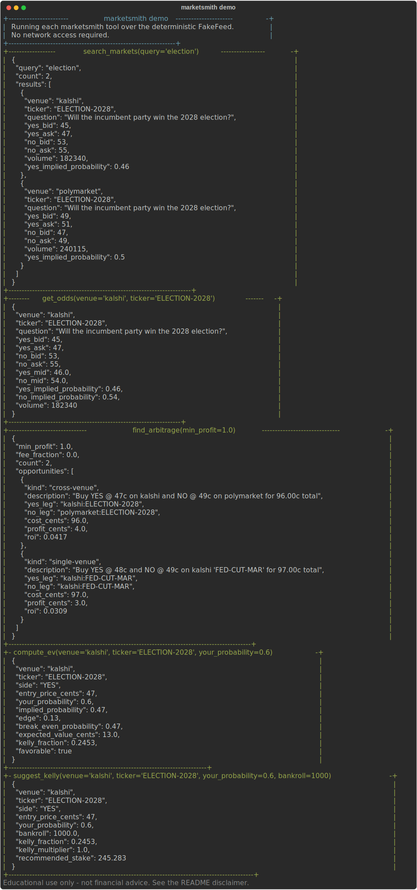
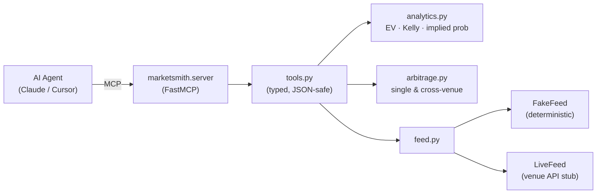

<div align="center">


# marketsmith

**An MCP server that gives your AI agent an edge in prediction markets — search markets, live odds, fee-adjusted arbitrage, EV & Kelly, over Model Context Protocol.**

_Built and maintained by [Viprasol Tech](https://viprasol.com)._

[](https://github.com/Viprasol-Tech/marketsmith/actions/workflows/ci.yml)
[](LICENSE)
[](https://www.python.org/)
[](https://modelcontextprotocol.io/)
[](http://mypy-lang.org/)
[](https://t.me/viprasol_help)

</div>

<p align="center">
  
</p>

---

`marketsmith` is a [Model Context Protocol](https://modelcontextprotocol.io/) server
for **prediction markets** (Kalshi / Polymarket style). Plug it into any MCP client —
Claude Desktop, Cursor, or your own agent — and your model can suddenly **search
markets, read live odds, find fee-adjusted arbitrage, and size positions with
expected value and the Kelly criterion**, all through clean, typed tools.

The math lives in small, pure, fully-tested modules with **zero MCP dependency**;
the server is a thin adapter on top. It complements Viprasol's
[`edgehunt`](https://github.com/Viprasol-Tech/edgehunt) analytics engine by exposing
that capability to agents over MCP.

> **Educational software — not financial advice.** See the [disclaimer](#-disclaimer).

---

## 🔌 Add to Claude Desktop / Cursor

Install the server extra, then drop this into your MCP client config
(`claude_desktop_config.json` for Claude Desktop, or your Cursor MCP settings):

```jsonc
{
  "mcpServers": {
    "marketsmith": {
      "command": "marketsmith",
      "args": ["serve"]
    }
  }
}
```

Restart the client and ask your agent things like _"find me a risk-free arbitrage in
the prediction markets"_ or _"what's the EV of betting YES on the 2028 election at my
60% estimate?"_ — it will call the tools below.

---

## 🧰 Tools

| Tool | Parameters | Returns |
| --- | --- | --- |
| `search_markets` | `query` | Markets matching a keyword, with implied probabilities |
| `get_odds` | `venue, ticker` | Bid/ask, mids, and YES/NO implied probabilities |
| `find_arbitrage` | `min_profit, fee_fraction` | Single- & cross-venue locks sorted by profit |
| `compute_ev` | `venue, ticker, your_probability` | Edge, break-even, fee-adjusted EV (cents), Kelly fraction |
| `suggest_kelly` | `venue, ticker, your_probability, bankroll` | Kelly fraction and recommended stake |

---

## 🚀 Quickstart

```bash
# Base install (CLI + analytics, offline demo)
pip install marketsmith

# See every tool run over the bundled deterministic feed — no network needed
marketsmith demo

# List the exposed MCP tools and their schemas
marketsmith tools

# Run the MCP server over stdio (needs the optional 'mcp' extra)
pip install "marketsmith[server]"
marketsmith serve
```

---

## 🧑‍💻 Call a tool directly (it's just Python)

Every MCP tool is a plain, typed function returning a JSON-serializable dict, so you
can use marketsmith as a normal library:

```python
from marketsmith import tools

# Search
print(tools.search_markets("election"))

# Fee-adjusted arbitrage scan
print(tools.find_arbitrage_tool(min_profit=1.0, fee_fraction=0.01))

# Expected value of betting YES given your own probability
print(tools.compute_ev("kalshi", "ELECTION-2028", your_probability=0.60))

# Kelly-sized stake for a $1,000 bankroll
print(tools.suggest_kelly("kalshi", "ELECTION-2028", your_probability=0.60, bankroll=1000))
```

---

## 🔎 What it finds

- **Cross-venue arbitrage** — buy YES on one venue and NO on another for under $1
  (after fees) and lock in a guaranteed profit regardless of outcome.
- **Single-market locks** — YES ask + NO ask < $1 (fee-adjusted) on a single venue.
- **Mispricings** — where your probability estimate diverges from the market-implied
  probability, with the **edge** quantified.
- **Position sizing** — fee-adjusted **expected value** and **Kelly** (full or
  fractional) so the agent never over-bets.
- **Break-even** — the exact win rate at which a bet stops being profitable.

---

## 🗺️ Architecture



The MCP SDK is an **optional** dependency used only by `server.py`. All analytics are
in pure modules (`models`, `feed`, `analytics`, `arbitrage`, `tools`) that are
import-safe and unit-tested without it.

---

## 🛠️ Development

```bash
git clone https://github.com/Viprasol-Tech/marketsmith.git
cd marketsmith
python -m pip install -e ".[dev,server]"

ruff check .
ruff format --check .
mypy src
pytest
```

---

## 🧭 Roadmap

- [x] Pure analytics: implied probability, fee-adjusted EV, Kelly, break-even
- [x] Single- and cross-venue arbitrage detection
- [x] MCP server (FastMCP) exposing five tools
- [x] Offline `demo` and `tools` CLI commands
- [ ] Live Kalshi feed adapter
- [ ] Live Polymarket feed adapter
- [ ] Portfolio-level Kelly across correlated markets
- [ ] Streaming odds updates over MCP resources

---

## ❓ FAQ

**Does this place real trades?** No. marketsmith is read-and-reason only: it surfaces
odds, edges, and sizing. It never sends orders.

**Do I need the `mcp` package to try it?** No — `marketsmith demo` and
`marketsmith tools` run fully offline on the base install. Only `serve` needs
`pip install "marketsmith[server]"`.

**Where does the data come from?** The open-source build ships a deterministic
`FakeFeed` (with a real seeded arbitrage) so everything is reproducible. `LiveFeed` is
a documented stub you can wire to a venue's API.

**Is the math trustworthy?** The analytics are covered by 60+ unit tests with
hand-computed expected values. Read the code — it's small and typed.

---

## ⭐ Star marketsmith if it gave your agent an edge

If this saved you time or sharpened your agent, a star helps other builders find it.

---

## 📜 Disclaimer

marketsmith is provided for **educational and research purposes only**. It is **not
financial, investment, or trading advice**. Prediction markets carry risk; you can
lose money. Nothing here is a recommendation to buy or sell any contract. You are
solely responsible for your decisions and for complying with the laws and venue terms
that apply to you.

---

## Contact — Viprasol Tech Private Limited
- Website: [viprasol.com](https://viprasol.com)
- Email: [support@viprasol.com](mailto:support@viprasol.com)
- Telegram: [t.me/viprasol_help](https://t.me/viprasol_help) | WhatsApp: +91 96336 52112
- GitHub: [@Viprasol-Tech](https://github.com/Viprasol-Tech) | [LinkedIn](https://www.linkedin.com/in/viprasol/) | X [@viprasol](https://twitter.com/viprasol)

## License

[MIT](LICENSE) (c) 2025 Viprasol Tech Private Limited
